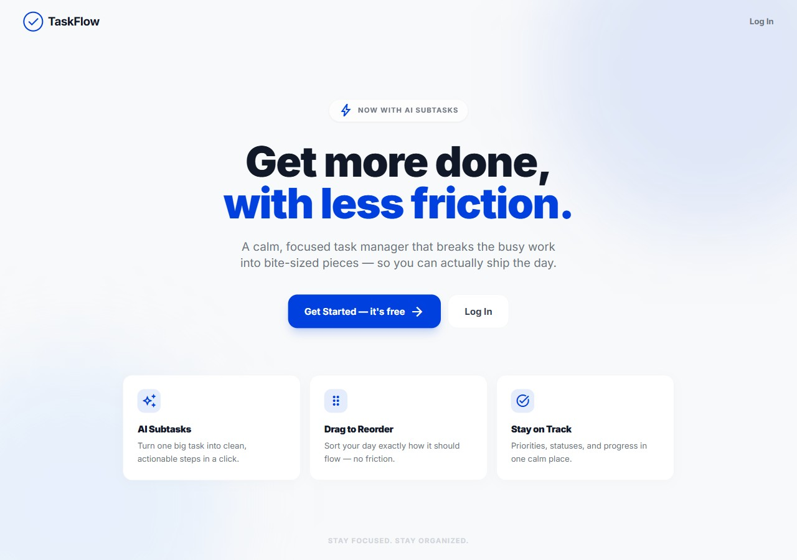
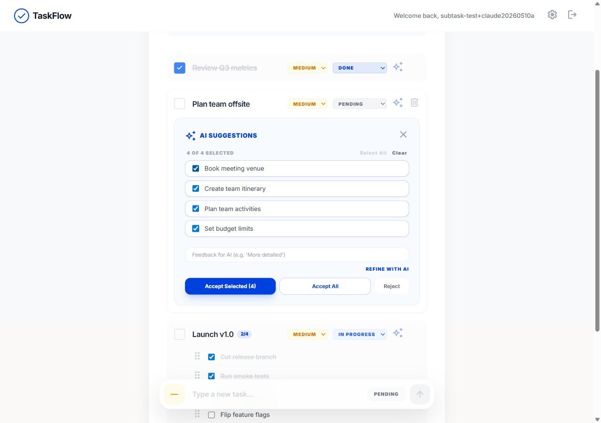
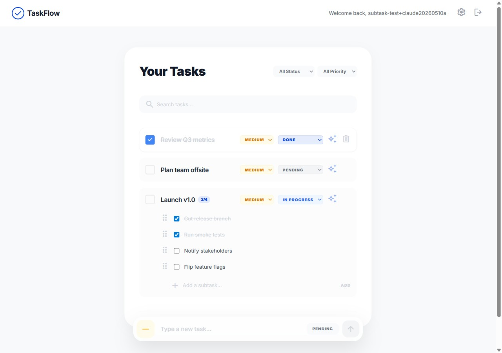
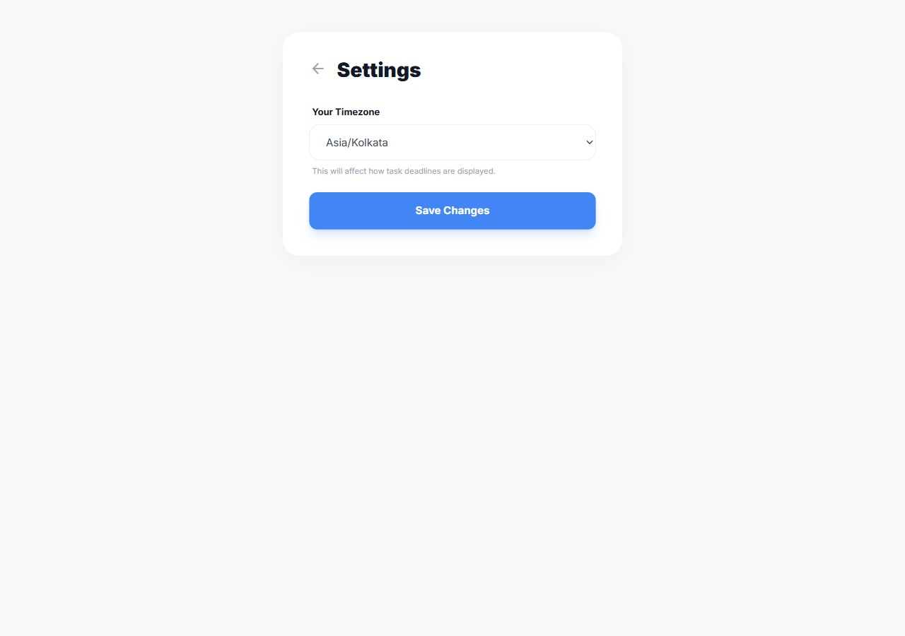
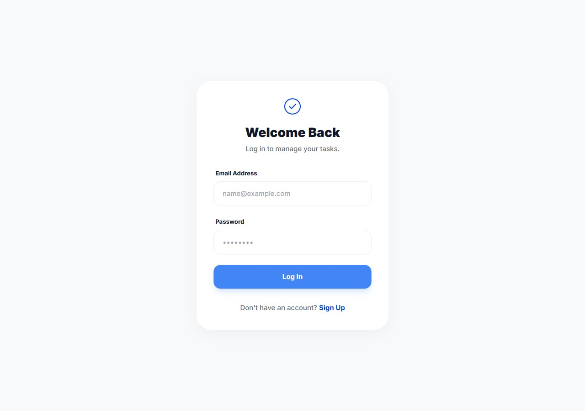

# TaskFlow

A calm, focused task manager that breaks busy work into bite-sized pieces — so you can actually ship the day.



---

## Features

### AI-generated subtasks
Turn one big task into a clean, actionable checklist with one click. Powered by Groq + Llama 3.3 70B running inside a Supabase Edge Function. Refine with natural-language feedback, then **Accept All** or pick only the suggestions you want with **Accept Selected**.



### Tasks, subtasks, drag to reorder
Add tasks, expand them inline to manage subtasks, drag the handles to reorder, and check things off. Completed counts (`2/4`) update live next to each task title.



### Priorities, statuses, search & filter
Each task has a priority (low / medium / high) and a status (pending / in-progress / done). Filter the list by either, or search by title.

### Settings
Per-user timezone (used for deadline display).



### Auth
Email + password sign-up and sign-in via Supabase Auth.



---

## Tech stack

| Layer | What |
|---|---|
| Frontend | Next.js 14 (App Router) · React 18 · TypeScript · Tailwind CSS |
| Drag & drop | `@dnd-kit/core` + `@dnd-kit/sortable` |
| Backend / DB / Auth | Supabase (Postgres + Row-Level Security + Auth) |
| AI subtasks | Supabase Edge Function (Deno) → Groq Chat Completions API |

---

## Project layout

```
.
├── taskflow_frontend/        Next.js app
│   ├── src/app/              routes (/, /signin, /signup, /settings)
│   ├── src/components/       AddTask, TaskList, SubtaskList, AISubtaskManager, Landing
│   ├── src/lib/supabase.ts   Supabase client + shared types
│   └── supabase/
│       ├── config.toml       per-function flags (verify_jwt, etc.)
│       ├── functions/
│       │   └── generate-subtasks/    edge function: prompts Groq, returns {subtasks: string[]}
│       └── migrations/       SQL migrations (schema + RLS + storage)
└── docs/screenshots/         README assets
```

---

## Quick start

### 1. Prerequisites
- Node.js 18+
- A Supabase project ([dashboard](https://supabase.com/dashboard))
- A Groq API key ([console](https://console.groq.com/keys))
- A Supabase personal access token ([generate here](https://supabase.com/dashboard/account/tokens))

### 2. Fill in env files

```bash
# At the repo root — used by the setup script (CLI tokens)
cp .env.example .env

# Inside the Next.js app — used by the browser at runtime
cp taskflow_frontend/.env.example taskflow_frontend/.env.local
```

Open both files and fill in the values. `.env` and `.env.local` are gitignored.

### 3. Install + one-shot setup

```bash
cd taskflow_frontend
npm install
npm run setup
```

`npm run setup` runs `scripts/setup.mjs`, which:
1. Links the Supabase CLI to your project,
2. Applies every SQL file in `supabase/migrations/`,
3. Sets `GROQ_API_KEY` as a Supabase function secret,
4. Deploys the `generate-subtasks` edge function.

It's idempotent — safe to re-run.

### 4. Run

```bash
npm run dev
```

Open [http://localhost:3000](http://localhost:3000).

> Want the full picture of what gets created in your Supabase project, the manual CLI commands behind `npm run setup`, or troubleshooting recipes? See [`docs/SETUP.md`](docs/SETUP.md).

---

## Notes

- The `generate-subtasks` edge function keeps `verify_jwt = true`, so only signed-in users can call it. `supabase-js` automatically attaches the user's session JWT when invoking.
- Subtask deletes are soft (`is_deleted = true`) so accidents are recoverable from the database.
- Subtask ordering uses an integer `position` column; reorder writes only the rows whose position actually changed.
